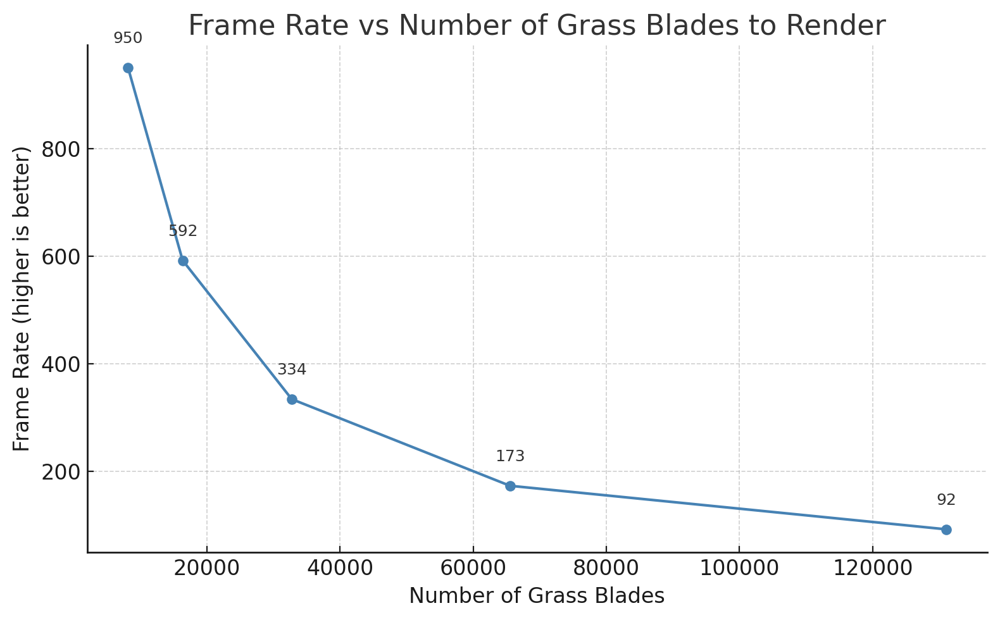
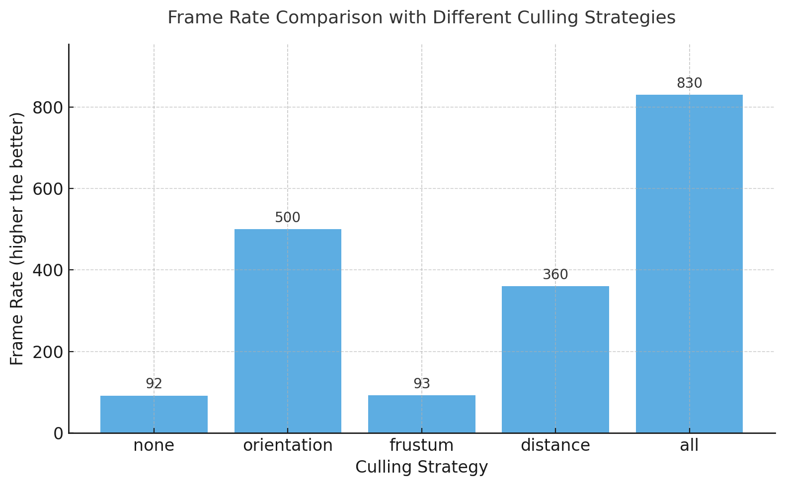
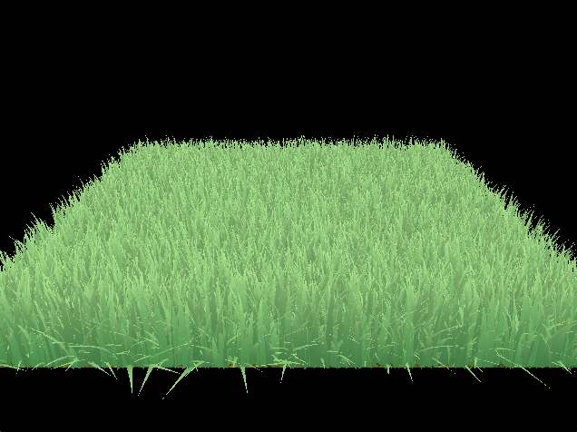

Vulkan Grass Rendering
==================================

**University of Pennsylvania, CIS 565: GPU Programming and Architecture, Project 5**

* Calvin Lieu
  * [LinkedIn](www.linkedin.com/in/calvin-lieu-91912927b)
* Tested on: Windows 11, i5-13450HX @ 2.40GHz 16GB, NVIDIA GeForce RTX 5050 Laptop GPU 8GB (Personal)

---

## Overview

This project implements a real-time **Vulkan grass simulation and renderer**, inspired by *Jahrmann et al., Responsive Real-Time Grass Rendering for General 3D Scenes (2017)*.

Each grass blade is modeled as a **cubic Bezier curve** and simulated using a compute shader that applies physical forces such as **wind, gravity, and recovery tension**. To maintain performance with thousands of dynamic blades, a suite of **GPU-based culling strategies**—orientation, frustum, and distance—are applied before tessellation.

---

## Features

### Grass Representation — Bezier Blades

Each blade of grass is represented by three Bezier control points:

| Control Point | Description |
|----------------|--------------|
| **v₀** | Root position on the surface |
| **v₁** | Directional guide that defines curvature |
| **v₂** | Physical tip simulated with dynamic forces |

Each blade also stores per-instance parameters:
- Orientation (`v0.w`)
- Height (`v1.w`)
- Width (`v2.w`)
- Stiffness (`up.w`)

This representation enables continuous deformation with minimal data per blade.

---

### 🌪️ Physics Simulation (Compute Shader)

Grass motion is governed by forces applied each frame to the tip point `v₂`:

1. **Gravity**  
   A combination of environmental gravity and a front-facing term tilts blades in the direction opposite to their orientation, mimicking droop from weight.

2. **Recovery Force**  
   Acts as a spring restoring `v₂` toward its rest position (`v₀ + up * height`), proportional to stiffness. This keeps the blade upright after bending.

3. **Wind**  
   A procedurally generated wind field introduces oscillatory sway using trigonometric noise functions. The resulting motion depends on alignment between blade direction and wind vector.

4. **Constraint Correction**  
   After force integration, blade control points are corrected to preserve physical length and prevent `v₂` from penetrating below the surface.

---

## Culling Strategies

Culling reduces GPU workload by eliminating blades that would have little or no visual impact. Each test is implemented in the compute shader and removes blades before they reach the graphics pipeline.

### 1. Orientation Culling

When a blade’s face is nearly **parallel to the camera view direction**, it contributes less than a pixel’s width to the frame.  
Those blades are removed to prevent aliasing and wasted shading effort.

---

### 2. View-Frustum Culling

The visibility of each blade is tested using three representative Bezier positions (`v₀`, `v₂`, and midpoint `m = ¼v₀ + ½v₁ + ¼v₂`).  
If all are outside the camera’s clip space (within tolerance), the blade is excluded.  
This ensures only visible geometry enters tessellation.

### With Frustum

### Without Frustum (and other culling)

---

### 3. Distance Culling

Beyond a configurable maximum distance, blades are culled based on their projected size and distance bucket.  
Near blades are always retained, while those farther away are removed stochastically, maintaining perceptual density while cutting vertex load.

---

## Tessellation and Rendering

Remaining blades are sent to the **tessellation pipeline**, where:
- Each patch represents one Bezier blade.
- The tessellation control shader dynamically adjusts subdivision based on distance.
- The tessellation evaluation shader expands each curve into a quad surface aligned with its orientation and width.

This allows smooth curvature close-up while minimizing geometry for distant regions.

---

## Performance Analysis

### Grass Density Scaling

The following chart shows frame rate scaling with the number of simulated grass blades:

Even as the count increases exponentially, GPU utilization remains efficient due to culling and compact simulation. The performance curve shows a predictable transition from compute-bound to rasterization-bound workloads as visible blade density increases.

---

### Comparison of Culling Techniques

Performance improvement from each culling method and their combined effect:

| Culling Method | FPS |
|-----------|-----|
| None | 92 |
| Orientation | 500 |
| Frustum | 93 |
| Distance | 360 |
| All | 830 |

Note that the relative benefits of each culling method vary extremely depending on the exact camera orientation of the render. The position that was used is shown below. Orientation and distance culling deliver the greatest gains, while frustum culling’s impact depends strongly on camera coverage. Combining all methods yields a substantial reduction in per-frame cost without visual loss.

---

### References

* Jahrmann, M., Wimmer, M. (2017). *Responsive Real-Time Grass Rendering for General 3D Scenes.*  
  Institute of Computer Graphics and Algorithms, TU Wien.  
  [Link to paper](https://www.cg.tuwien.ac.at/research/publications/2017/JAHRMANN-2017-RRTG/JAHRMANN-2017-RRTG-draft.pdf)

---
